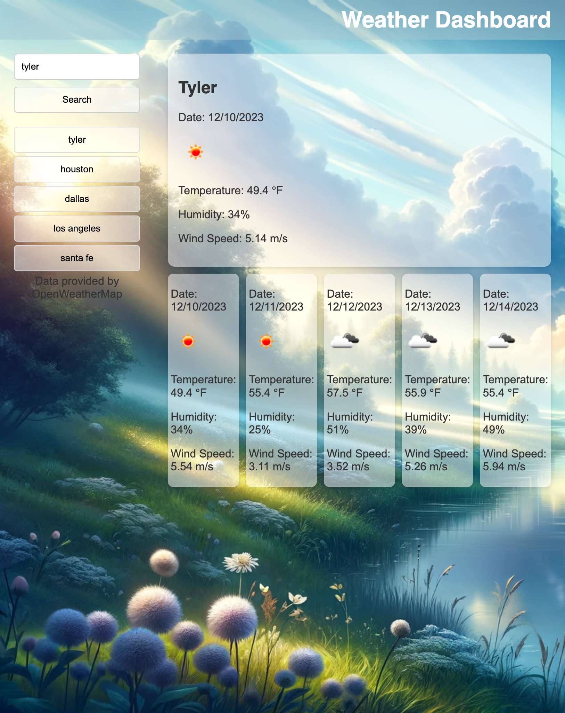

# weather-dashboard
Accurate Weather Webpage 

## Description

This webpage is designed to show you the current weather along with a 5 day forecast for a city of your choice. Once you search a city, it is saved on the left side of your screen for you to view again at any time. I created this so i could get weather updates in real time. I learned how to use an API successfully and no longer have to wonder what temperature it is outside. 

## Usage 

To use the Weather Dashboard webpage, simply click on this link here: 

Once you are on the webpage, type a city into the search bar and examine the weather for today and the next 5 days so you can plan accordingly. after reviewing the first cities weahter, type in another ity into your search bar and watch as your previous city is saved on the left side of the screen for quick access in the future. see a screenshit below for your reference. 

## Credits 

https://openweathermap.org/api
https://web.stanford.edu/group/csp/cs22/using-an-api.pdf
https://stackoverflow.com/questions/71853102/saving-updates-into-localstorage-and-having-a-history-of-previous-inputs
https://coding-boot-camp.github.io/full-stack/github/professional-readme-guide
https://awigmore.medium.com/how-do-i-add-the-weather-forecast-to-my-web-page-be3e5c7e5d06

 ## License

 MIT License

Copyright (c) 2023 Landon Jett

Permission is hereby granted, free of charge, to any person obtaining a copy
of this software and associated documentation files (the "Software"), to deal
in the Software without restriction, including without limitation the rights
to use, copy, modify, merge, publish, distribute, sublicense, and/or sell
copies of the Software, and to permit persons to whom the Software is
furnished to do so, subject to the following conditions:

The above copyright notice and this permission notice shall be included in all
copies or substantial portions of the Software.

THE SOFTWARE IS PROVIDED "AS IS", WITHOUT WARRANTY OF ANY KIND, EXPRESS OR
IMPLIED, INCLUDING BUT NOT LIMITED TO THE WARRANTIES OF MERCHANTABILITY,
FITNESS FOR A PARTICULAR PURPOSE AND NONINFRINGEMENT. IN NO EVENT SHALL THE
AUTHORS OR COPYRIGHT HOLDERS BE LIABLE FOR ANY CLAIM, DAMAGES OR OTHER
LIABILITY, WHETHER IN AN ACTION OF CONTRACT, TORT OR OTHERWISE, ARISING FROM,
OUT OF OR IN CONNECTION WITH THE SOFTWARE OR THE USE OR OTHER DEALINGS IN THE
SOFTWARE.

